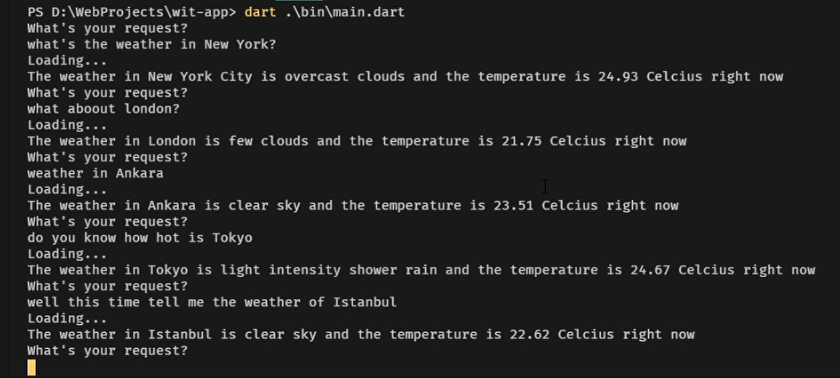

A Terminal app that uses wit.ai and shows weathers to user from any city. 

1. Takes the user request and send to the with.ai
2. Wit parses the request and sends the response to me.
3. I determine the function and the parameters.

You can see the video of the example usecase. 
[video](https://www.mertakca.me/2020/07/weather-terminal-app-with-witai.html)